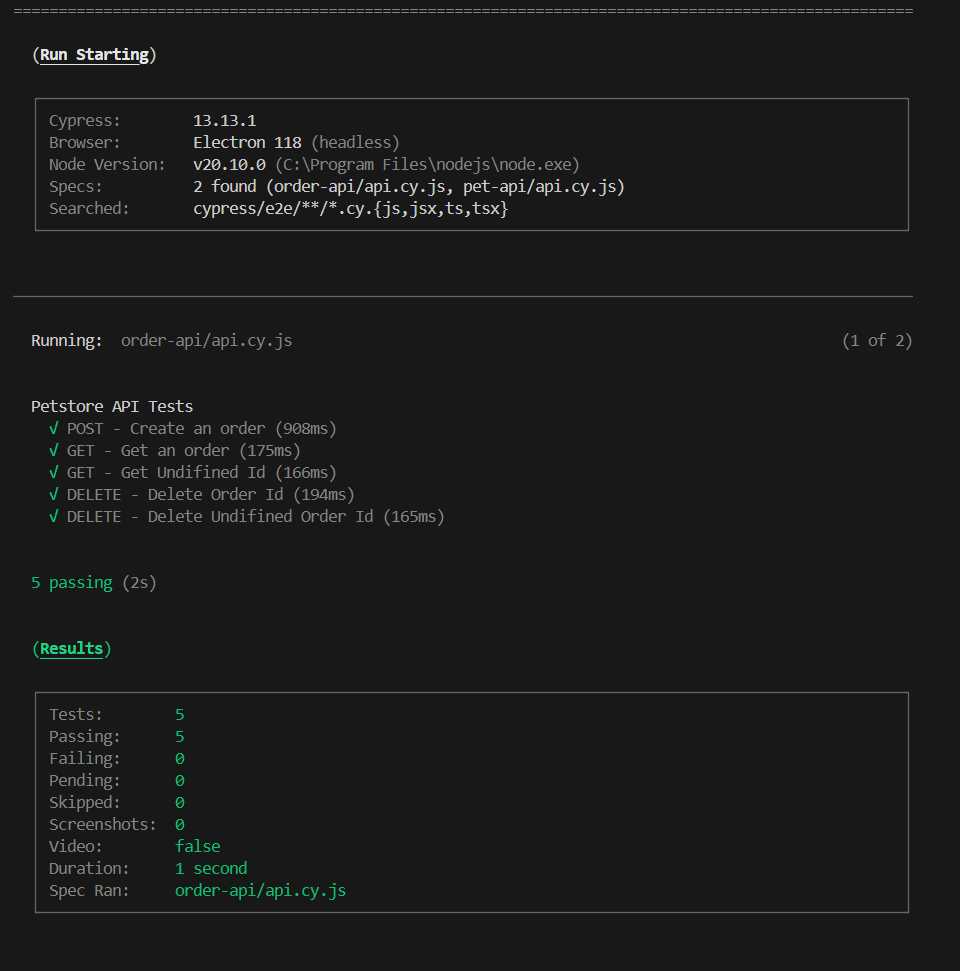
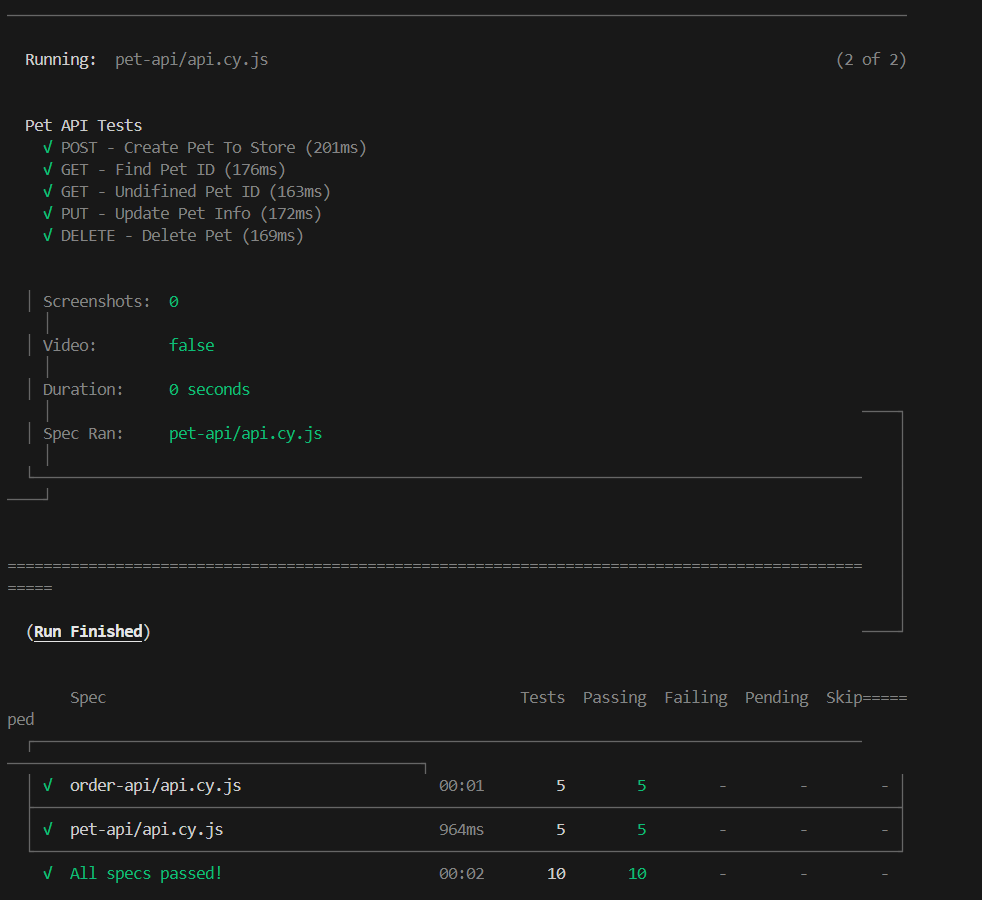
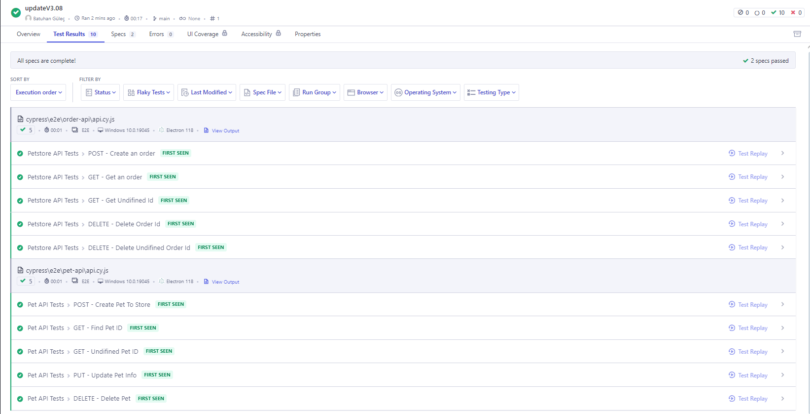

# Petstore API Test Automation
Bu proje, Petstore API'sinin çeşitli yöntemlerini test etmek için Postman ve Cypress kullanarak otomatik test senaryoları oluşturur. 
API'nin GET, POST, PUT ve DELETE metodları üzerinde testler yapılmıştır.

**Postman Koleksiyonu:** [PetstoreAPI.postman_collection.json](https://github.com/batuhanngulec/SwaggerUiApiTest/blob/main/test-result/PetstoreAPI.postman_collection.json)

## Kurulum

1. Bu repoyu klonlayın:
    ```bash
    git clone https://github.com/batuhanngulec/SwaggerUiApiTest
    ```

2. Gerekli bağımlılıkları yükleyin:
    ```bash
    npm install
    ```

3. Cypress testlerini çalıştırın:
    ```bash
    npx cypress run
    ```
## Test Senaryoları

### Pet API Testleri
1. **POST - Create Pet To Store**: Petstore'a yeni bir pet ekler.
2. **GET - Find Pet ID**: Belirtilen ID'ye sahip peti bulur.
3. **GET - Undefined Pet ID**: Tanımlanmamış bir pet ID ile sorgulama yapar ve 404 döner.
4. **PUT - Update Pet Info**: Var olan bir petin bilgilerini günceller.
5. **DELETE - Delete Pet**: Belirtilen ID'ye sahip peti siler.

### Order API Testleri
1. **POST - Create an Order**: Yeni bir sipariş oluşturur.
2. **GET - Get an Order**: Belirtilen ID'ye sahip siparişi alır.
3. **GET - Get Undefined Id**: Tanımlanmamış bir sipariş ID ile sorgulama yapar ve 404 döner.
4. **DELETE - Delete Order Id**: Belirtilen ID'ye sahip siparişi siler.
5. **DELETE - Delete Undefined Order Id**: Tanımlanmamış bir sipariş ID ile silme yapar ve 404 döner.

## Test Sonuçları

Tüm test senaryoları başarıyla çalışmıştır. Aşağıda her testin başarılı olup olmadığını gösteren sonuçlar bulunmaktadır:

- **Pet API Tests**: Başarılı
    - POST - Create Pet To Store: Başarılı
    - GET - Find Pet ID: Başarılı
    - GET - Undefined Pet ID: Başarılı (404 döndürdü)
    - PUT - Update Pet Info: Başarılı
    - DELETE - Delete Pet: Başarılı

- **Order API Tests**: Başarılı
    - POST - Create an Order: Başarılı
    - GET - Get an Order: Başarılı
    - GET - Get Undefined Id: Başarılı (404 döndürdü)
    - DELETE - Delete Order Id: Başarılı
    - DELETE - Delete Undefined Order Id: Başarılı (404 döndürdü)
 
### Test Çıktıları

Aşağıda testlerin çalıştırılması sırasında elde edilen ekran görüntüleri bulunmaktadır:

1. **Order API Test Sonuçları**
   

2. **Pet API Test Sonuçları**
   

## Cypress Cloud Kurulumu ve Test Sonuçları

### Cypress Cloud Hesabına Projeyi Bağlama

1. Cypress Dashboard'da bir proje oluşturun ve projenize özel API anahtarını alın.
2. Proje dizininde `.cypress.json` dosyasına aşağıdaki şekilde API anahtarınızı ekleyin:
    ```json
    {
      "projectId": "your_project_id"
    }
    ```
3. Cypress Cloud'a giriş yapmak için:
    ```bash
    npx cypress cloud
    ```

4. Testlerinizi Cypress Cloud'da çalıştırın:
    ```bash
    npx cypress run --record --key your_record_key
    ```

### Cypress Cloud Test Sonuçları

Aşağıda Cypress Cloud'da çalıştırılan testlerin başarılı sonuçlarını gösteren ekran görüntüsü bulunmaktadır:


 
